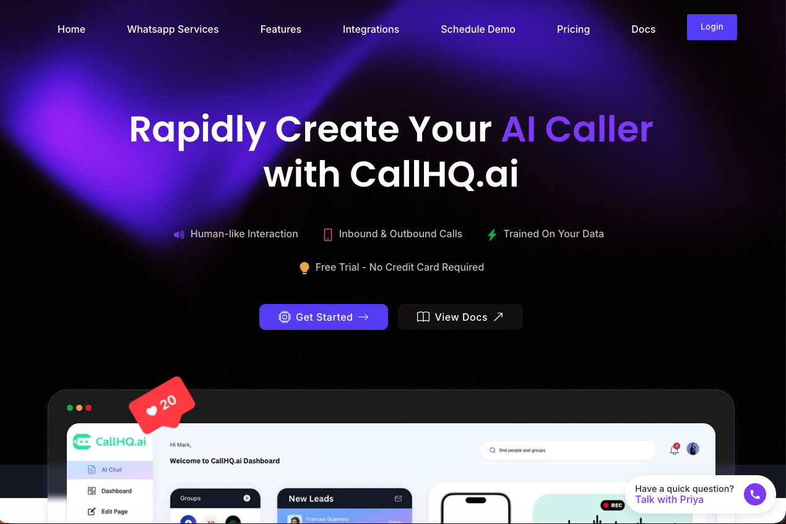

# 🚀 Akash Malhotra — 3D Portfolio

Interactive 3D developer portfolio with a keyboard where every keycap is a skill. Built with Next.js, React, TypeScript, GSAP, and Motion.

Forked from [Naresh Khatri's 3d-portfolio](https://github.com/Naresh-Khatri/3d-portfolio) template and customized for [Akash Malhotra](https://github.com/akashrmalhotra).

[](https://vercel.com/new/clone?repository-url=https://github.com/akashrmalhotra/3d-portfolio-next)



## ✨ Features

- **Interactive 3D Keyboard** — Custom Spline keyboard where each keycap represents a skill, revealing titles and descriptions on hover/press
- **Buttery Animations** — GSAP + Motion powered scroll, hover, and reveal animations
- **Space Theme** — Floating particles on a dark canvas for a cosmic vibe
- **Light & Dark Mode** — Full theme support with cheeky disclaimer toasts
- **Responsive** — Works across all screen sizes
- **Contact Form** — Email delivery via Resend
- **Analytics** _(optional)_ — Umami analytics integration

## 🛠️ Tech Stack

| Layer | Technologies |
|---|---|
| **Framework** | Next.js 16, React 19, TypeScript |
| **Styling** | Tailwind CSS, Shadcn UI |
| **Animation** | GSAP, Motion |
| **3D** | Spline Runtime |
| **Email** | Resend |
| **Misc** | Lenis (smooth scroll), Zod, @teispace/next-themes |

---

## 🚀 Getting Started

### Prerequisites

- Node.js (v18+)
- npm, pnpm, or yarn

### Installation

1. **Clone the repository:**

    ```bash
    git clone https://github.com/akashrmalhotra/3d-portfolio-next.git
    cd 3d-portfolio-next
    ```

2. **Install dependencies:**

    ```bash
    npm install
    ```

3. **Set up environment variables:**

    Copy `.env.example` to `.env.local` and fill in the values:

    ```bash
    cp .env.example .env.local
    ```

    | Variable | Required | Description |
    |---|---|---|
    | `RESEND_API_KEY` | Yes | API key from [Resend](https://resend.com) for the contact form |
    | `NEXT_PUBLIC_WS_URL` | No | WebSocket server URL for realtime features (cursors, chat, presence) |
    | `UMAMI_DOMAIN` | No | Umami analytics script URL |
    | `UMAMI_SITE_ID` | No | Umami website ID |

4. **Run the development server:**

    ```bash
    npm run dev
    ```

5. Open [http://localhost:3000](http://localhost:3000) and see the magic ✨

---

## 🎨 Personalization

All personal info is centralized in [`src/data/config.ts`](src/data/config.ts):

```ts
const config = {
  title: "Akash Malhotra | Co-Founder & Engineer",
  author: "Akash Malhotra",
  email: "contact@broki.in",
  site: "https://broki.in",
  githubUsername: "akashrmalhotra",
  githubRepo: "3d-portfolio-next",
  social: {
    linkedin: "https://www.linkedin.com/in/akashrmalhotra",
    github: "https://github.com/akashrmalhotra",
    // ...
  },
};
```

Other files to customize:

| File | What to change |
|---|---|
| `src/data/projects.tsx` | Projects, screenshots, descriptions, and tech stacks |
| `src/data/constants.ts` | Skills list and work experience |
| `public/Akash_Malhotra_Resume.pdf` | Résumé PDF for the resume page |
| `public/assets/projects-screenshots/` | Project screenshots (`callhq/`, `broki/`, etc.) |
| `public/assets/seo/og-image.png` | Social share preview image |

### Projects

Screenshots live under `public/assets/projects-screenshots/<project-id>/`. Current projects:

- [CallHQ.ai](https://callhq.ai)
- [Broki](https://broki.in)
- [CallHQ WhatsApp](https://whatsapp.callhq.ai)
- [Orrdr](https://orrdr.com)
- [Otoma8](https://otoma8.com)
- [Tesoro by Sania](https://tesorobysania.com)

---

## ⌨️ Updating the 3D Keyboard Skills

The 3D keyboard keycaps are baked into a Spline file. To update the skills displayed on the keyboard:

1. **Import** the `public/assets/skills-keyboard.spline` file into [Spline](https://spline.design/)
2. **Unhide** the keycap objects you want to edit
3. **Update** the logo images on each keycap to your new skill icons
4. **Rename** each keycap object to match the skill's `name` field in `src/data/constants.ts` (e.g. `js`, `react`, `docker`)
5. **Hide** all keycap objects again
6. **Export** the scene and overwrite `public/assets/skills-keyboard.spline`

After updating the Spline file, make sure `src/data/constants.ts` has matching entries for every skill on the keyboard:

```ts
export const SKILLS: Record<SkillNames, Skill> = {
  js: { name: "js", label: "JavaScript", shortDescription: "...", ... },
  react: { name: "react", label: "React", shortDescription: "...", ... },
  // ... add/remove entries to match your keyboard
};
```

The `SkillNames` enum, `SKILLS` record, and the Spline keycap names must all stay in sync for the keyboard interactions to work correctly.

---

## 🔌 Realtime Features (Optional)

The portfolio supports optional realtime features powered by a **separate backend API**:

- 🖱️ **Live cursors** — See other visitors' cursors in realtime
- 👥 **Online presence** — Shows who's currently on the site
- 💬 **Chat** — Live chat between visitors

These features activate automatically when the `NEXT_PUBLIC_WS_URL` environment variable is set. Without it, the portfolio works perfectly fine as a static site — no realtime features, no backend dependency.

---

## 🚀 Deployment

[](https://vercel.com/new/clone?repository-url=https://github.com/akashrmalhotra/3d-portfolio-next)

This site is deployed on **Vercel**. To deploy your own:

1. Push your code to a GitHub repository
2. Connect the repository to [Vercel](https://vercel.com)
3. Add your environment variables in the Vercel dashboard
4. Vercel handles the rest — automatic deployments on every push

---

## 📄 License & Credits

This project is open source and available under the [MIT License](LICENSE).

Built on the excellent [3d-portfolio](https://github.com/Naresh-Khatri/3d-portfolio) template by [Naresh Khatri](https://github.com/Naresh-Khatri). If you use this template, a credit or link back to the original repo would be much appreciated ❤️
